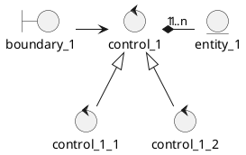
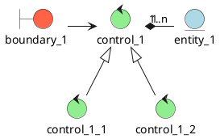

## 准备工作

1. vscode：[官方网站](https://code.visualstudio.com/)
2. 插件：vscode 中搜索插件 PlantUML 并进行安装，需要注意的是，如果使用 ssh 远程编辑，则还需在 remote 端安装此插件
4. graphviz：由于 PlantUML 是在 graphviz 基础上运行的，所以需要下载并安装 graphviz（[下载页面](https://graphviz.org/download/)）。如果不想本地安装，也有[在线网页](https://www.plantuml.com/plantuml/uml/SyfFKj2rKt3CoKnELR1Io4ZDoSa70000)进行图形输出。
3. java环境：graphviz 的运行需要 java 环境，[下载java](https://www.java.com/en/download/)。或者 linux 环境下直接 `sudo apt install openjdk-17-jdk`。

## 开始编辑

PlantUML 语法见[官方手册](https://plantuml.com/zh/)

在任意一个文档（推荐新建后缀为`.puml`的文件）中输入 PlantUML 的代码，使用快捷键`Alt+D`（Macos 下可能是 `Opt+D`）即可实时预览自动排版的 UML 图。

效果如下（左边是代码，按了快捷键后自动分出右边窗口用来同步显示）：

## 常用技巧

### 分析类图

例如利用如下代码：

可以绘制出：


@startuml 分析类图

boundary boundary_1

control control_1
control control_1_1
control control_1_2

entity entity_1

' relations
control_1 <|-- control_1_1
control_1 <|-- control_1_2

control_1 "1" *- "1..n" entity_1

boundary_1 -> control_1

@enduml


总结来说，可以使用`boundary`来定义边界类，可以使用`control`来定义控制类，使用`entity`来定义实体类。

### 颜色

使用`skinparam`可以统一定义每种元素的颜色，例如修改上面的代码，增加`skinparam`：

可以得到如下效果：


@startuml 分析类图

skinparam boundary {
  BackgroundColor tomato
}

skinparam control {
  BackgroundColor lightgreen
}

skinparam entity {
  BackgroundColor lightblue
}

boundary boundary_1

control control_1
control control_1_1
control control_1_2

entity entity_1

' relations
control_1 <|-- control_1_1
control_1 <|-- control_1_2

control_1 "1" *- "1..n" entity_1

boundary_1 -> control_1

@enduml


当然也可以单独修改每个元素的颜色、线的颜色以及粗细。这些就当遇到时再去查看手册吧。

### 排版

手册中给了类似于`-d->`或者`-down->`的方式用来指定连线方向，但是当图变得很复杂时如果还这样做就容易导致干扰图形引擎。我的经验是只使用默认的横向线`->`和纵向线`-->`。
其中横向线是从左连向右的，例如`a->b`意味着`a`会倾向于排版在`b`的左边。如果需要`a`在`b`的右边只需要把箭头位置调换变成`b<-a`即可。
同理`a-->b`意味着`a`被倾向于排版在`b`的上面。

如果两个元素之间没有线连接，比如上面例子中的`control_1_1`和`control_1_2`，如果对它们的位置不满意，也有一种利用隐藏线的方式，将上述代码中加入`control_1_2 -[hidden] control_1_1`，这两个元素的位置便会被调换，效果如下：


@startuml 分析类图

skinparam boundary {
  BackgroundColor tomato
}

skinparam control {
  BackgroundColor lightgreen
}

skinparam entity {
  BackgroundColor lightblue
}

boundary boundary_1

control control_1
control control_1_1
control control_1_2

entity entity_1

' relations
control_1 <|-- control_1_1
control_1 <|-- control_1_2

control_1 "1" *- "1..n" entity_1

boundary_1 -> control_1

control_1_2 -[hidden] control_1_1

@enduml


两种隐藏线：
- `-[hidden]`
- `-[hidden]-`
