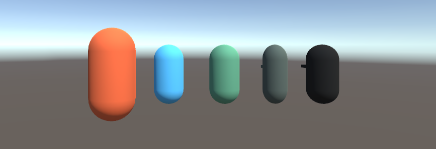
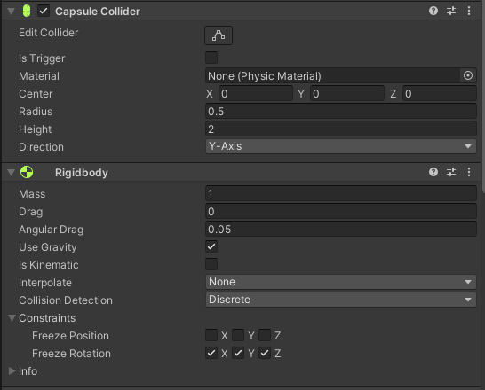
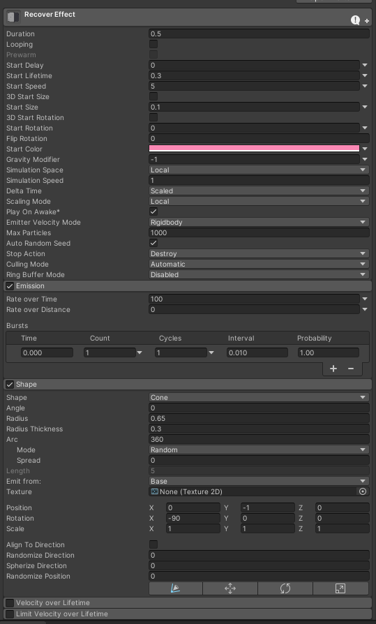
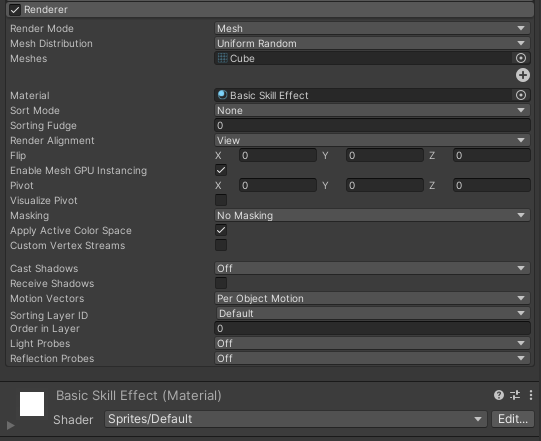
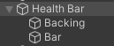
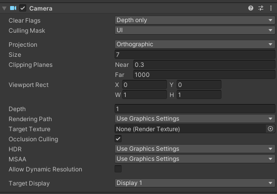

<div style="position: relative; width: 100%; height: 0; padding-bottom: 75%;"><iframe 
src="//player.bilibili.com/player.html?aid=269009801&bvid=BV1wc411L78j&cid=1070306432&page=1&autoplay=false" 
scrolling="no" border="0" frameborder="no" framespacing="0" allowfullscreen="true" 
style="position: absolute; width: 100%; height: 100%; left: 0; top: 0;"> </iframe></div>

<!-- more -->



学习Unity3D过程中做的第一个项目，项目主体框架是照着这个教程做的：
https://www.youtube.com/playlist?list=PLFt_AvWsXl0ctd4dgE1F8g3uec4zKNRV0
后续增加了道具拾取以及升级的功能。

写这篇博客主要目的是将这个过程中学到的一些功能的典型实现摘出来，尽量避开记录这款游戏本身，而是讲解通用功能的实现。
（如果想复习这个特定游戏的开发，可以重新再看一遍教程）

------------------------

本篇为系列的角色篇，目标是回顾完这一篇章之后可以做出来一个功能齐全的角色，经过一定程度的针对性扩展可以让这个角色出现在不同的游戏中。

**目录**
1. 角色控制
2. 角色生命
3. 镜头控制
4. 准心显示

------------------------

## 1. 角色控制

给角色添加Collider以及Rigidbody，并在角色身上添加Player.cs，以后对于角色的按键输入都由Player.cs来处理。
记得锁定角色旋转以防角色“过分”的物理模拟。



为角色添加PlayerController.cs脚本，该脚本负责角色的移动。

PlayerController.cs
```C#
Vector3 velocity;
Rigidbody myRigidbody;

void Start()
{
    myRigidbody = GetComponent<Rigidbody>();
}

public void Move(Vector3 _velocity)
{
    velocity = _velocity;
}

void FixedUpdate()
{
    myRigidbody.MovePosition(myRigidbody.position + velocity * Time.deltaTime);
}
```

流程是Player检测到移动角色的按键输入，于是调用PlayerContrller中的Move方法，Move方法设定好角色的移动速度向量，每次FixedUpdate到来时依照速度向量来移动角色。

Player.cs
```C#
public float moveSpeed = 5;

PlayerController controller;

private void Awake()
{
    controller = GetComponent<PlayerController>();
}

void Update()
{
    // movement input
    Vector3 moveInput = new Vector3(Input.GetAxisRaw("Horizontal"), 0, Input.GetAxisRaw("Vertical"));
    Vector3 moveVelocity = moveInput.normalized * moveSpeed;
    controller.Move(moveVelocity);
}
```

------------------------

## 2. 角色生命

注意到生命值这个属性，无论是对于角色，还是对于敌人都是可用的，所以新建一个父类，叫做LivingEntity，新建一个接口，叫做IDamageable。

LivingEntity.cs
```C#
public class LivingEntity : MonoBehaviour, IDamageable
{
    public float startingHealth;

    public float health { get; protected set; }
    protected bool dead;

    public event Action OndDeath;

    protected virtual void Start()
    {
        health = startingHealth;
    }

    public virtual void TakeHit(float damage, Vector3 hitPoint, Vector3 hitDirection)
    {
        TakeDamage(damage);
    }

    public virtual void TakeDamage(float damage)
    {
        health -= damage;

        if (health <= 0 && !dead)
        {
            Die();
        }
    }

    [ContextMenu("Self Destruct")]
    public virtual void Die()
    {
        dead = true;
        if (OndDeath != null) OndDeath();
        Destroy(gameObject);
    }
}
```

IDamageable.cs
```C#
public interface IDamageable
{
    void TakeHit(float damage, Vector3 hitPoint, Vector3 hitDirection);

    void TakeDamage(float damage);
}
```

让Player继承LivingEntity，则角色有了生命值属性。但是光使用LivingEntity中的TakeDamage方法，没有任何击中反馈，表现到游戏中则是玩家很容易忽视自己受到伤害这件事情，“死”得不明不白的。所以我们在Player中重载TakeDamage方法，加入动画效果实现受伤反馈。反馈的形式可以自由创造，这里实现一种颜色变化的方式。
同时加入Recover方法，让角色有机会得到治疗。（当然，将Recover方法放到IDamageable和LivingEntity中是更合理的方式，这里偷懒了）

Player.cs
```C#
public ParticleSystem recoverEffect;

Material skinMatetial;
Color originalColor;

private void Awake()
{
    skinMatetial = GetComponent<Renderer>().material;
    originalColor = skinMatetial.color;
}

public override void TakeDamage(float damage)
{
    base.TakeDamage(damage);

    StartCoroutine(AnimateTakeDamage());
}

IEnumerator AnimateTakeDamage()
{
    float percent = 0;
    float speed = 1 / 0.2f;

    while (percent < 1)
    {
        percent += Time.deltaTime * speed;
        skinMatetial.color = Color.Lerp(Color.red, originalColor, percent);

        yield return null;
    }
}

public void Recover(float value)
{
    health = Mathf.Clamp(health + value, 0, startingHealth);
    ParticleSystem newRecoverEffect = Instantiate(recoverEffect, transform.position, Quaternion.identity);
    newRecoverEffect.transform.SetParent(transform, false);
    newRecoverEffect.transform.localPosition = Vector3.zero;
}

public override void Die()
{
    AudioManager.instance.PlaySound("Player Death", transform.position);
    base.Die();
}
```

注意到我们重写了Die方法，里面用到了AudioManager的单例，以后我们会单独开一个章节讲AudioManager。

### 粒子效果
Recover方法中用到了粒子效果，该效果的参数如下：（角色拾取恢复道具时围绕在角色周围的粉红色粒子效果）



### UI
另外，对于血条，这里采用UI的实现方式。Backing是一层半透明的黑色背景层，Bar是血条本体，这些内容放在UI的Canvas的Fight UI中。

UI的Canvas有一个脚本GameUI.cs，专门用来控制游戏中所有UI的控制。public的成员可以从Unity中拖动对象到脚本属性中来初始化，当然也可以像player一样在代码中初始化，不过这就要考虑到找不到的情况了，各有应用的场景。

GameUI.cs
```C#
public RectTransform healthBar;
Player player;

void Start()
{
    player = FindObjectOfType<Player>();
    if (player != null)
    {
        // ...
    }
}

private void Update()
{
    UpdateFightUI();
}

void UpdateFightUI()
{
    float healthPercent = 0;
    if (player != null)
    {
        healthPercent = player.health / player.startingHealth;
    }
    healthBar.localScale = new Vector3(healthPercent, 1, 1);
}
```

### 特殊
还有一些比较特别的场景也需要操作角色的生命值。这些就具体游戏具体实现了吧，这里给些小参考。
比如说角色掉出了地图之外，需要有重新正常进行游戏的机制，这里检测角色的y坐标，小于一定程度就判断为角色掉出地图外，直接扣除所有生命值。
Player.cs
```C#
void Update()
{
    // fall to die
    if (transform.position.y < -10)
    {
        TakeDamage(health);
    }
}
```

又比如说新关卡开启时，角色的状态应该是满的，所以在Player这里接收关卡控制器（以后讲）的新关卡事件。
```C#
private void Awake()
{
    FindObjectOfType<EnemySpawner>().OnNewStage += OnNewStage;
}

void OnNewStage(EnemySpawner.Stage stage)
{
    health = startingHealth;
}
```

------------------------

## 3. 镜头控制

对于俯视角射击游戏来说，镜头的控制比较简单，只需要镜头跟着角色移动就行了，第三人称游戏那些镜头遮挡问题暂时不会涉及。
教程中的镜头只有跟随角色移动的部分，不过有了挺进地牢的游戏体验，如果镜头在跟随角色移动的过程中，也可以因为准心的不同方向而稍微偏移到那个方向，体验上会直观很多。我的版本实现了这个特性。

PlayerController中加入LookAt方法，Player每一帧获取鼠标的位置，以此坐标调用PlayerController的LookAt方法，该方法会改变角色的朝向，让角色看向准心位置，再调用CameraMovement方法移动摄像机。
CameraMovement方法先是计算准心与角色之间的距离，将这个距离限制到10单位之内，换算成10单位的百分比，插值到sightDistanceMinMax中设置的镜头偏移最大最小值中。这个sightDistanceMinMax是在脚本属性页面设置的。

PlayerController.cs
```C#
public Vector2 sightDistanceMinMax;

Vector3 cameraOffset;

void Start()
{
    cameraOffset = Camera.main.transform.position;
}

public void LookAt(Vector3 lookPoint)
{
    Vector3 heightCorrectedPoint = new Vector3(lookPoint.x, transform.position.y, lookPoint.z);
    transform.LookAt(heightCorrectedPoint);

    CameraMovement(heightCorrectedPoint);
}

void CameraMovement(Vector3 heightCorrectedPoint)
{
    Vector3 lookDirection = heightCorrectedPoint - transform.position;
    float lookDistance = Mathf.Lerp(sightDistanceMinMax.x, sightDistanceMinMax.y,
        Mathf.Clamp(lookDirection.magnitude, 0, 10) / 10);
    Camera.main.transform.position = transform.position + cameraOffset + lookDirection.normalized * lookDistance;
}
```

Player.cs
```C#
void Update()
{
    // look input
    Ray ray = viewCamera.ScreenPointToRay(Input.mousePosition);
    Plane groundPlane = new Plane(Vector3.up, Vector3.up * gunController.GunHeight);
    if (Time.timeScale > 0 && groundPlane.Raycast(ray, out float rayDistance))
    {
        Vector3 point = ray.GetPoint(rayDistance);
        // Debug.DrawLine(ray.origin, point, Color.red);
        controller.LookAt(point);
    }
}
```

------------------------

## 4. 准心显示

准心由两个部分组成，中心小圆点和外围轮廓。各个部分有不同作用：
- 小圆点在检测到敌人时会改变颜色，提示可以进行攻击；
- 外围轮廓有缩放以及旋转的动画，让玩家能更容易找到准心的位置，不至于在很乱的游戏场景中丢失了准心。


为准心添加上Crosshairs.cs脚本，用来控制其动画效果。
Crosshairs.cs
```C#
public class Crosshairs : MonoBehaviour
{
    public LayerMask targetMask;
    public SpriteRenderer dot;
    public Transform crosshair;
    public Color dotHighlightColor;

    Color originalDotColor;
    Vector3 originalCrosshairScale;

    private void Start()
    {
        originalDotColor = dot.color;
        originalCrosshairScale = crosshair.localScale;
    }

    void Update()
    {
        transform.Rotate(Vector3.up * 40 * Time.deltaTime);
        float percent = Mathf.PingPong(Time.time, 1);
        crosshair.localScale = Vector3.Lerp(originalCrosshairScale, originalCrosshairScale + Vector3.one * .04f, percent);
    }

    public void DetectTargets(Ray ray)
    {
        if (Physics.Raycast(ray, 100, targetMask))
        {
            dot.color = dotHighlightColor;
        }
        else
        {
            dot.color = originalDotColor;
        }
    }
}
```

### 渲染

此时虽然能显示准心了，可是发现准心会跟场景中的物体进行交互，准心移动到场景中的物体背面时会出现遮挡的现象。
要实现准心始终渲染到最顶层，有一个好的方法是将准心与UI放到一起去渲染。

- 添加一个Layer叫做UI，修改准心对象的Layer为UI
- 修改摄像机的Culling Mask，去除其中的UI
- 添加一个摄像机，作为主摄像机的子对象，该摄像机的参数设置如下：



### 位置

由于准心的位置需要跟玩家鼠标的输入绑定，而玩家的输入是在Player中处理的，所以将准心的移动代码写到这里。

Player.cs
```C#
public Crosshairs crosshairs;

// look input
if (Time.timeScale > 0 && groundPlane.Raycast(ray, out float rayDistance))
{
    // ...
    crosshairs.transform.position = point;
    crosshairs.DetectTargets(ray);
}
```

------------------------

角色篇先写这么多，接下来写地图篇。篇章顺序应是从最通用到最不通用。
