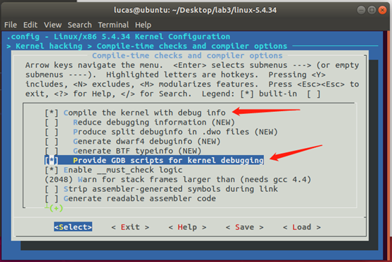
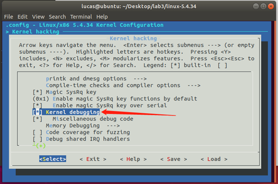
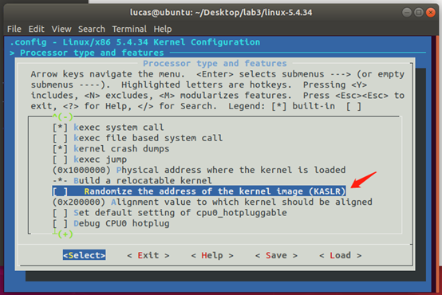
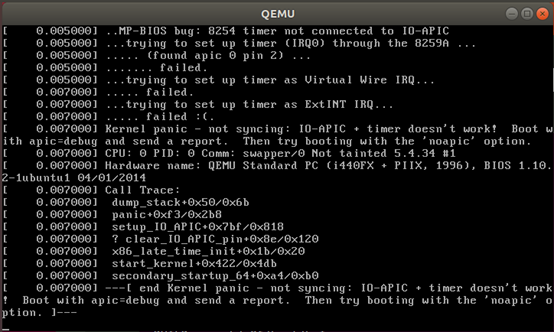
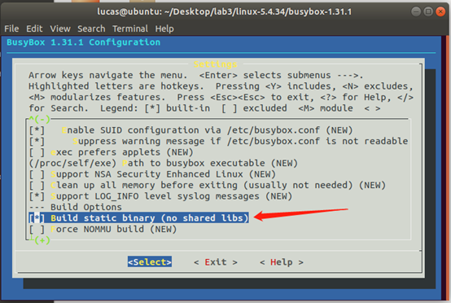
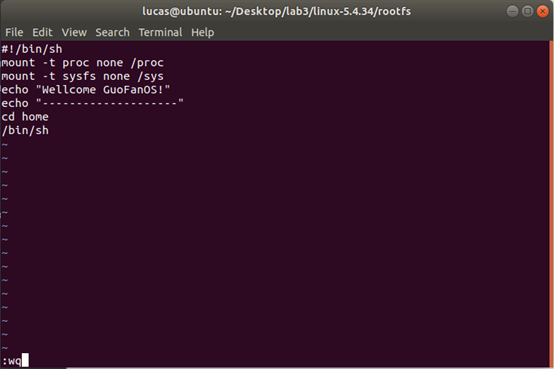
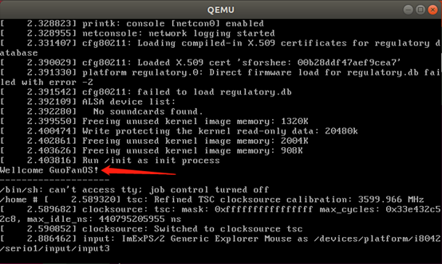
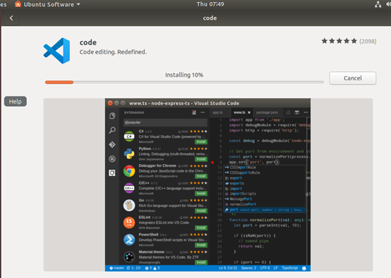
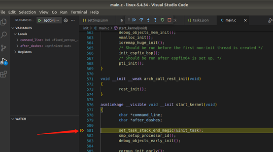

环境：Ubuntu-18.04

### 1. 安装开发工具

```
lucas@ubuntu:~/Desktop/lab3$ sudo apt install build-essential
lucas@ubuntu:~/Desktop/lab3$ sudo apt install qemu
lucas@ubuntu:~/Desktop/lab3$ sudo apt install libncurses5-dev bison flex libssl-dev libelf-dev
```

### 2. 下载内核源码

```
lucas@ubuntu:~/Desktop/lab3$ sudo apt install axel
lucas@ubuntu:~/Desktop/lab3$ axel -n 20 https://mirrors.edge.kernel.org/pub/linux/kernel/v5.x/linux-5.4.34.tar.xz

lucas@ubuntu:~/Desktop/lab3$ xz -d linux-5.4.34.tar.xz
lucas@ubuntu:~/Desktop/lab3$ tar -xvf linux-5.4.34.tar
lucas@ubuntu:~/Desktop/lab3$ cd linux-5.4.34/
```

### 3. 配置内核选项

```
lucas@ubuntu:~/Desktop/lab3/linux-5.4.34$ make defconfig
lucas@ubuntu:~/Desktop/lab3/linux-5.4.34$ make menuconfig
```




### 4. 编译和运行

```
lucas@ubuntu:~/Desktop/lab3/linux-5.4.34$ make -j$(nproc)
lucas@ubuntu:~/Desktop/lab3/linux-5.4.34$ qemu-system-x86_64 -kernel arch/x86/boot/bzImage
```


### 5. 制作根文件系统

使用busybox
```
lucas@ubuntu:~/Desktop/lab3/linux-5.4.34$ axel -n 20 https://busybox.net/downloads/busybox-1.31.1.tar.bz2
lucas@ubuntu:~/Desktop/lab3/linux-5.4.34$ tar -jxvf busybox-1.31.1.tar.bz2
lucas@ubuntu:~/Desktop/lab3/linux-5.4.34$ cd busybox-1.31.1

lucas@ubuntu:~/Desktop/lab3/linux-5.4.34/busybox-1.31.1$ make menuconfig
```
配置静态编译


```
lucas@ubuntu:~/Desktop/lab3/linux-5.4.34/busybox-1.31.1$ make -j$(nproc) && make install
```

制作内存根文件镜像
```
lucas@ubuntu:~/Desktop/lab3/linux-5.4.34/busybox-1.31.1$ cd ../../linux-5.4.34/
lucas@ubuntu:~/Desktop/lab3/linux-5.4.34$ mkdir rootfs 
lucas@ubuntu:~/Desktop/lab3/linux-5.4.34$ cd rootfs 
lucas@ubuntu:~/Desktop/lab3/linux-5.4.34/rootfs$ cp ../busybox-1.31.1/_install/* ./ -rf 
lucas@ubuntu:~/Desktop/lab3/linux-5.4.34/rootfs$ mkdir dev proc sys home 
lucas@ubuntu:~/Desktop/lab3/linux-5.4.34/rootfs$ sudo cp -a /dev/{null,console,tty,tty1,tty2,tty3,tty4} dev/
```

制作init文件
```
lucas@ubuntu:~/Desktop/lab3/linux-5.4.34/rootfs$ touch init
lucas@ubuntu:~/Desktop/lab3/linux-5.4.34/rootfs$ sudo apt install vim
lucas@ubuntu:~/Desktop/lab3/linux-5.4.34/rootfs$ vim init
```

其中mount命令是对proc和sys进行挂载，为init添加执行权限：
```
lucas@ubuntu:~/Desktop/lab3/linux-5.4.34/rootfs$ chmod +x init
```
 打包成内存根文件系统镜像
```
lucas@ubuntu:~/Desktop/lab3/linux-5.4.34/rootfs$ find . -print0 | cpio --null -ov --format=newc | gzip -9 > ../rootfs.cpio.gz
```
测试挂载根文件系统，看内核启动完成后是否执行init脚本
```
lucas@ubuntu:~/Desktop/lab3/linux-5.4.34/rootfs$ cd ..
lucas@ubuntu:~/Desktop/lab3/linux-5.4.34$ qemu-system-x86_64 -kernel ./arch/x86/boot/bzImage -initrd rootfs.cpio.gz
```

成功！

### 5. 配置VSCode

从应用商店安装VSCode


打开VSCode
```
lucas@ubuntu:~/Desktop/lab3/linux-5.4.34$ code .
```

安装插件

使用快捷键Ctrl+`打开VSCode的终端，下载VSCode脚本并拷贝到新建的.vscode文件夹中
```
lucas@ubuntu:~/Desktop/lab3/linux-5.4.34$ python3 ./scripts/gen_compile_commands.py
lucas@ubuntu:~/Desktop/lab3/linux-5.4.34$ mkdir .vscode
lucas@ubuntu:~/Desktop/lab3/linux-5.4.34$ cd ..
lucas@ubuntu:~/Desktop/lab3$ sudo apt install git
lucas@ubuntu:~/Desktop/lab3$ git clone https://github.com/mengning/linuxkernel.git
lucas@ubuntu:~/Desktop/lab3$ cp linuxkernel/src/kerneldebuging/* linux-5.4.34/.vscode/
```

对脚本做如下修改：


在`start_kernel`函数中加入断点，使用快捷键F5开始调试，发现成功停在了断点处，环境配置完成

